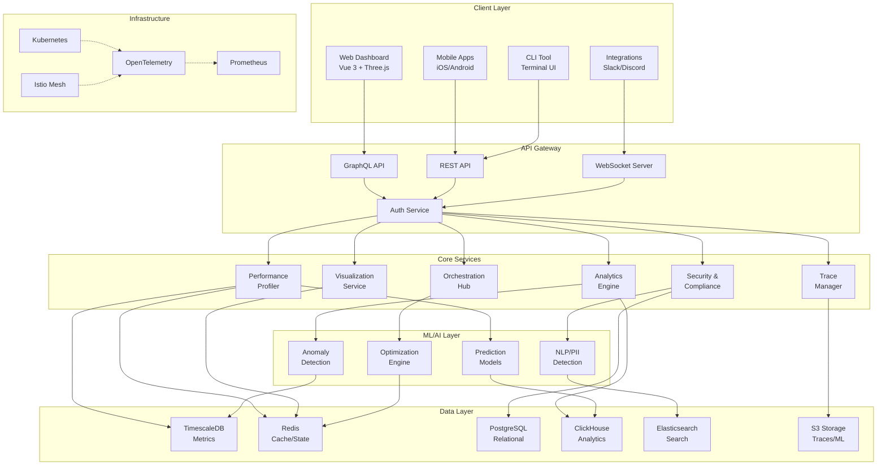
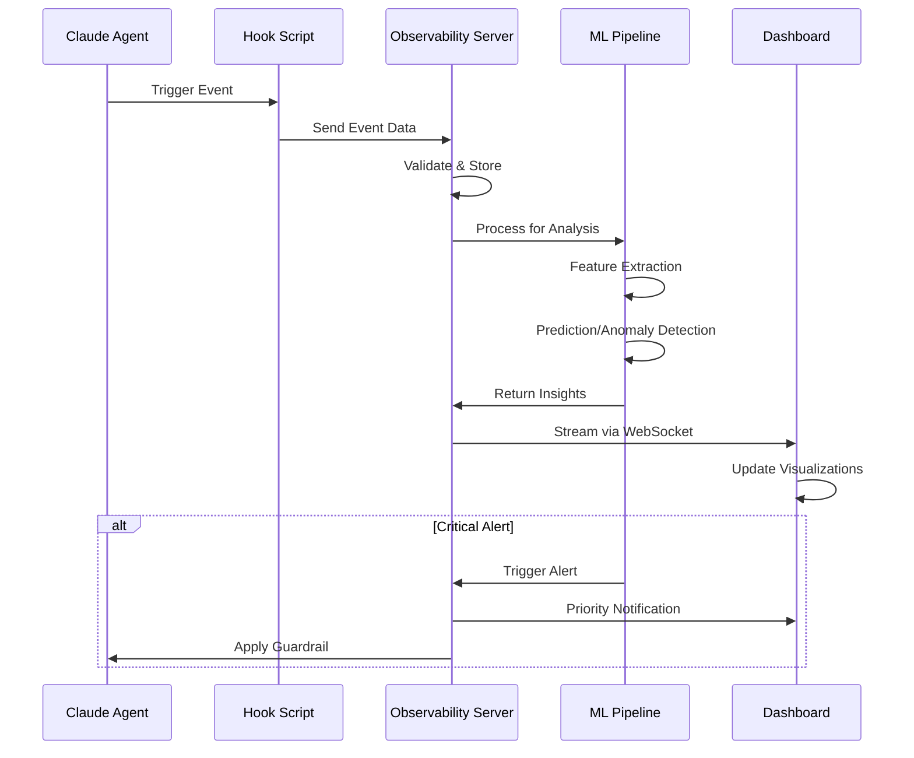
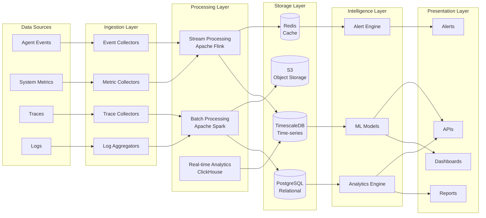
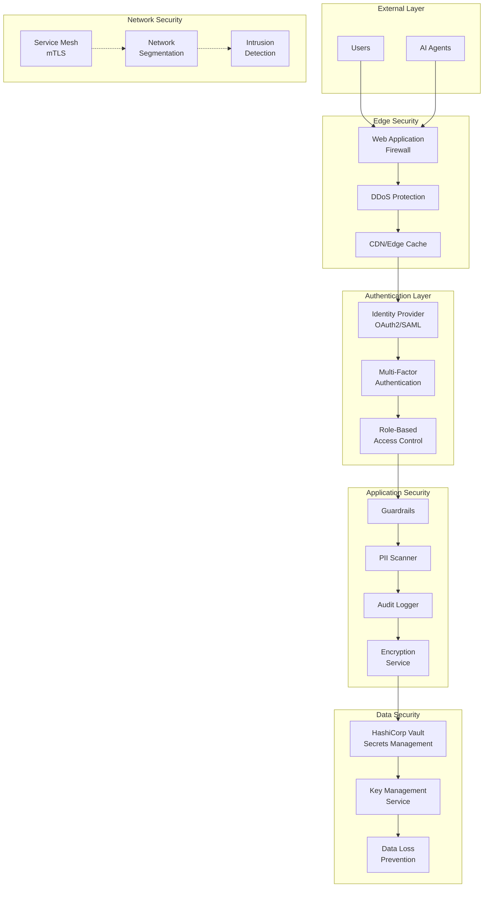
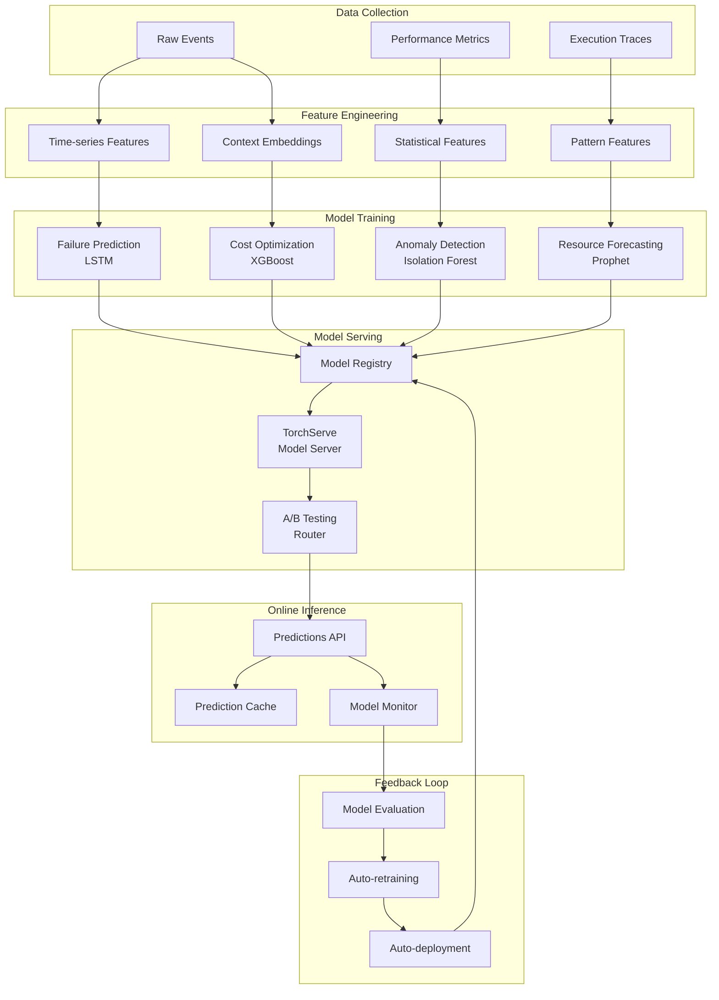
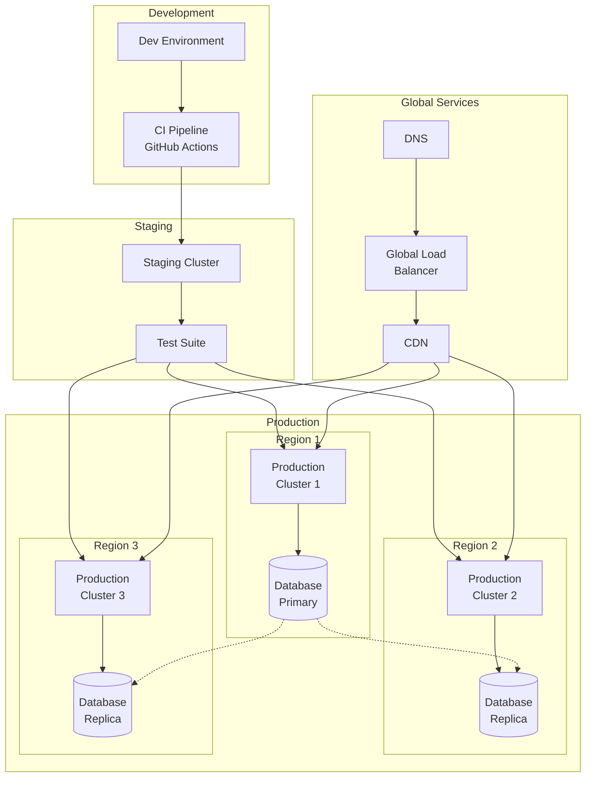
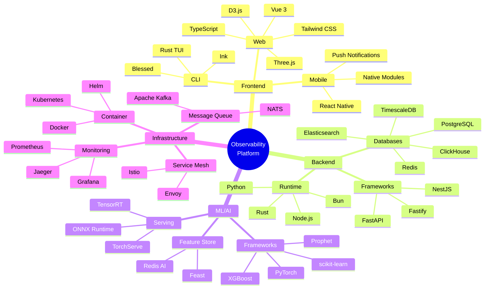
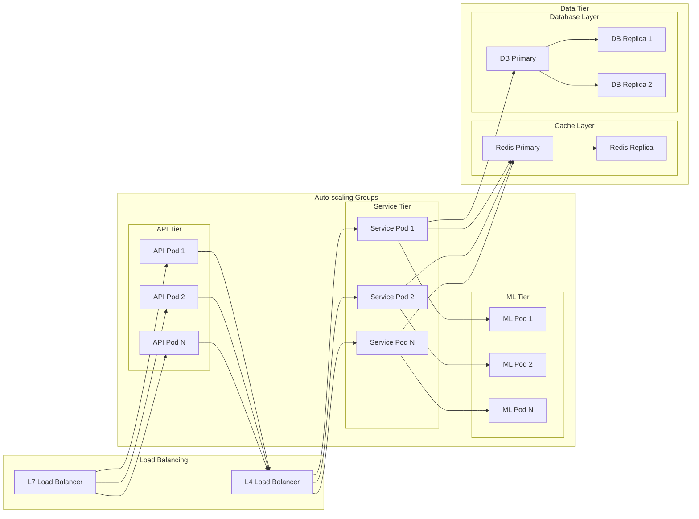
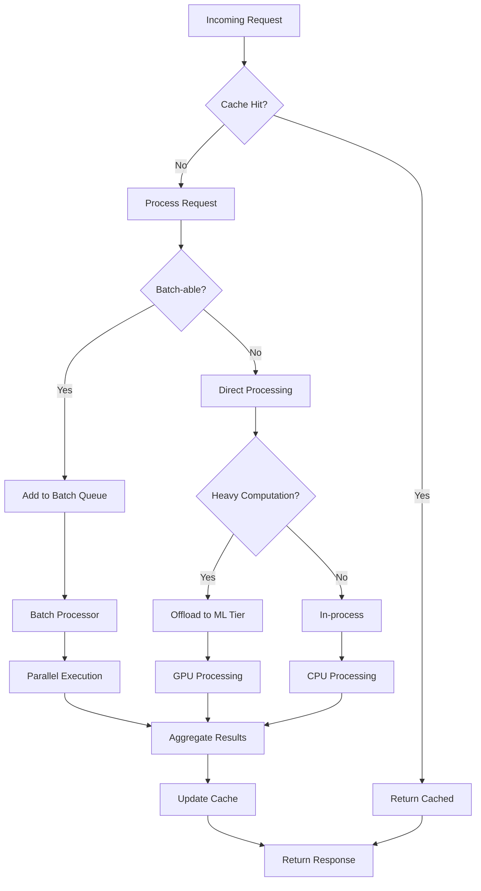
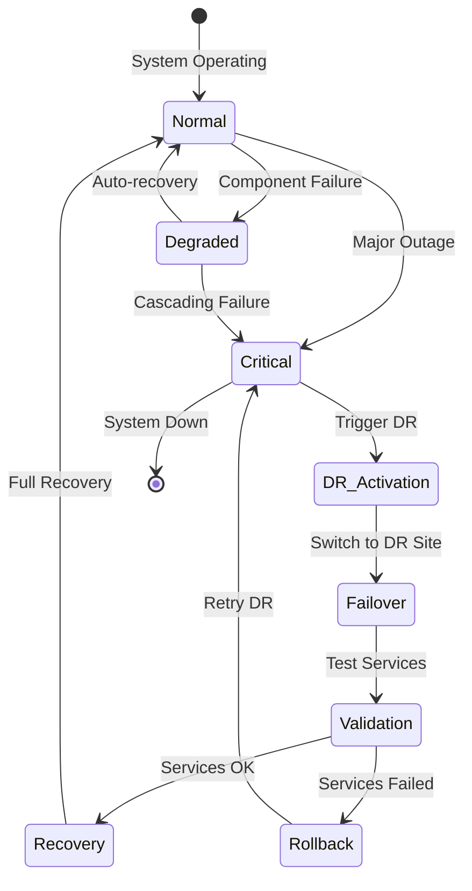

# Architecture Overview: Enhanced Multi-Agent Observability System v2.0

## System Architecture Diagram

## Component Interactions

## Data Flow Architecture

## Security Architecture

## ML Pipeline Architecture

## Deployment Architecture

## Technology Stack Overview

## Scalability Design

## Performance Optimization Strategy

## Disaster Recovery Plan

## Key Architecture Principles

1. **Microservices Architecture**: Each feature is a separate service for independent scaling
2. **Event-Driven Design**: Asynchronous processing for better performance
3. **Cloud-Native**: Kubernetes-based deployment for portability
4. **Security by Design**: Zero-trust architecture with encryption everywhere
5. **ML-First**: Intelligence built into every component
6. **Real-time Processing**: Sub-second latency for critical paths
7. **Fault Tolerance**: No single point of failure
8. **Observable by Default**: Every component emits detailed telemetry

## Next Steps

1. Review and approve architecture
2. Set up development environment
3. Begin Phase 1 implementation
4. Establish monitoring for architecture metrics
5. Create detailed design documents for each component